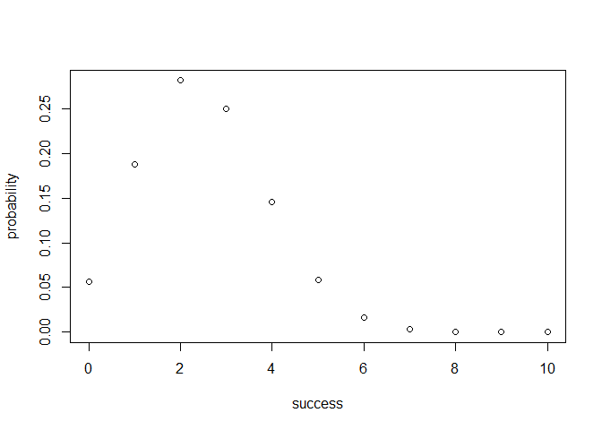
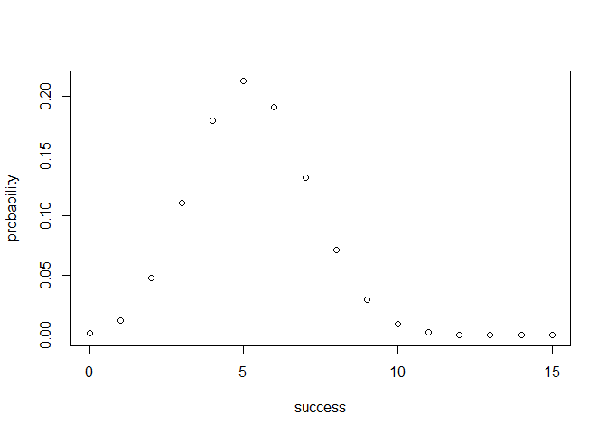

hw03-daniel-john
================
Daniel John
March 22, 2018

R Markdown
----------

This is an R Markdown document. Markdown is a simple formatting syntax for authoring HTML, PDF, and MS Word documents. For more details on using R Markdown see <http://rmarkdown.rstudio.com>.

When you click the **Knit** button a document will be generated that includes both content as well as the output of any embedded R code chunks within the document. You can embed an R code chunk like this:

``` r
summary(cars)
```

    ##      speed           dist       
    ##  Min.   : 4.0   Min.   :  2.00  
    ##  1st Qu.:12.0   1st Qu.: 26.00  
    ##  Median :15.0   Median : 36.00  
    ##  Mean   :15.4   Mean   : 42.98  
    ##  3rd Qu.:19.0   3rd Qu.: 56.00  
    ##  Max.   :25.0   Max.   :120.00

Including Plots
---------------

You can also embed plots, for example:


Note that the `echo = FALSE` parameter was added to the code chunk to prevent printing of the R code that generated the plot.

``` r
# Windows Note
## Please note: I am using a Windows computer, as such I am not able to insert the Bash code chunk as described in the requirements for this Homework. Professor Sanchez posted a workaround solution for Windows users where we write code but it will not be evaluated. Please refer to the announcement made by him on March 12. Thank you.
```

    #2.1) Pipeline for team names
    cut -d "," -f 2 nba2017-roster.csv | sort | uniq > team-names.txt
    head -5 team-names.txt

    #2.2) Pipeline for unique positions
    cut -d "," -f 3 nba2017-roster.csv | tail -n +2 | sort | uniq > position-names.txt
    head -5 position-names.txt

    #2.3) Pipeline to obtain the counts (frequencies) of experience values displayed descending
    cut -d "," -f 7 nba2017-roster.csv | tail -n +2 | sort -n | uniq -c > experience-counts.txt
    head -5 experience-counts.txt

    #2.4) New CSV file with LAC data
    grep "LAC\|player" nba2017-roster.csv > LAC.csv
    cat LAC.csv

    #2.5) Displaying the age frequencies of LAL players
    grep "LAL" nba2017-roster.csv | cut -d "," -f 6 | tail -n +2 | sort -n | uniq -c

    #2.6) Number of players in CLE
    cut -d "," -f 2 nba2017-roster.csv | sort | grep "CLE" | uniq -c

    #2.7) Creating CSV file for GSW
    egrep "height|GSW" nba2017-roster.csv | cut -d "," -f 1,4,5 > gsw-height-weight.csv
    cat gsw-height-weight.csv

    #2.8) File with top 10 player salaries, arranged descending
    cut -d "," -f 1,8 nba2017-roster.csv | head -n 1 > top10-salaries.csv
    cut -d "," -f 1,8 nba2017-roster.csv | sort -k 2 -t "," -n -r | head >> top10-salaries.csv
    cat top10-salaries.csv

``` r
#Importing R script into Rmd file
source("code/binomial-functions.R")
```

``` r
#Probability of getting exactly 3 sixes
bin_probability(10,3,1/6)
```

    ## [1] 0.1550454

``` r
#Distribution of the number of sixes when rolling the .25 loaded die 
plot(bin_distribution(10,.25))
```



``` r
#The probability of geting more than 3 heads in 5 tosses with a .35 biased coin
bin_prob_a <- bin_probability(5,4,.35)
bin_prob_b <- bin_probability(5,5,.35)
bin_prob_c <- (bin_prob_a + bin_prob_b)
bin_prob_c
```

    ## [1] 0.0540225

``` r
##Couldn't figure out how to do it with a for loop. sorry. 
```

``` r
#The probability distribution of the number of heads with a .35 loaded coin
plot(bin_distribution(15,.35))
```


