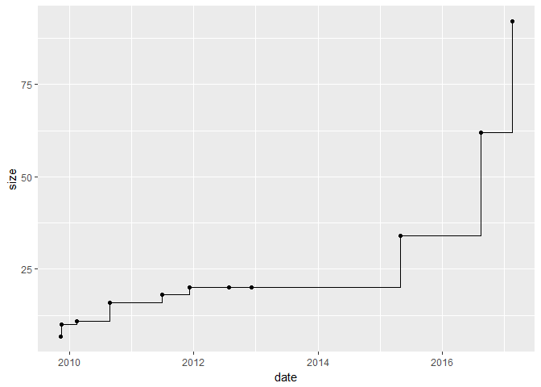
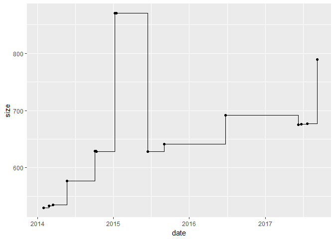
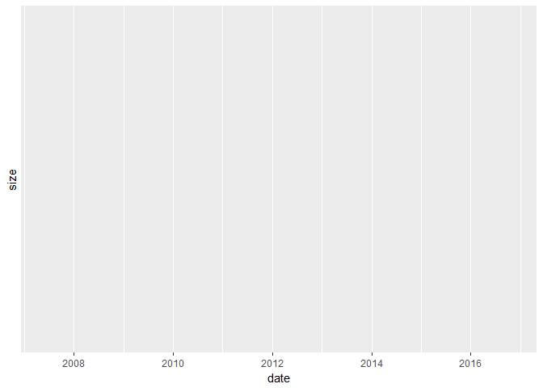
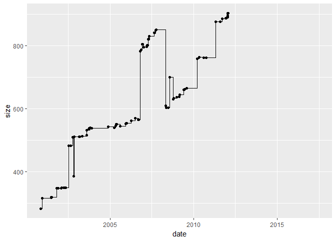
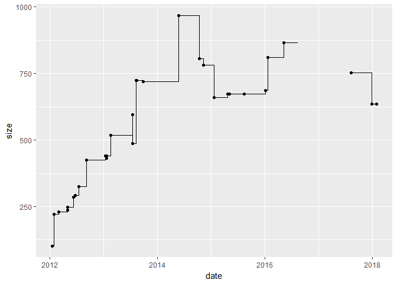
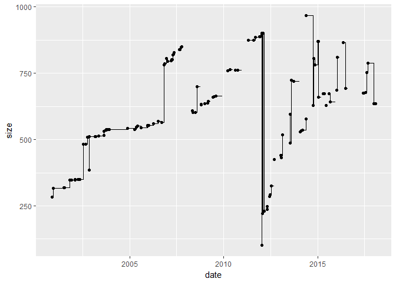
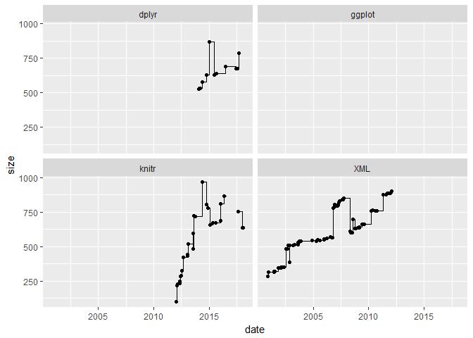
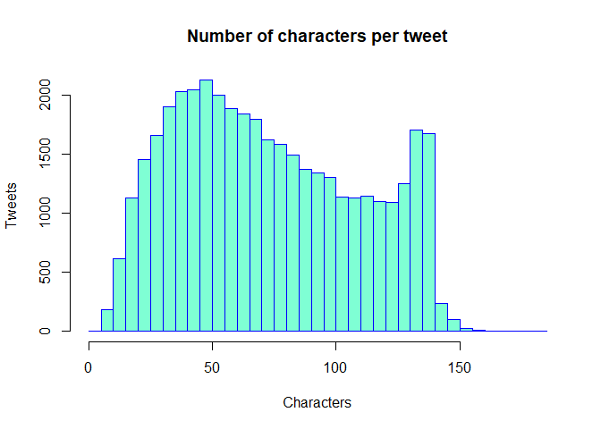
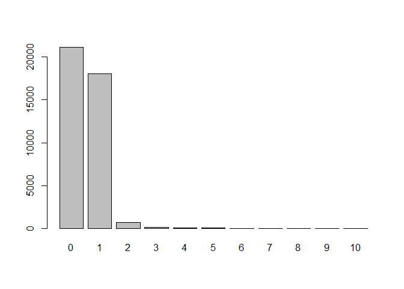
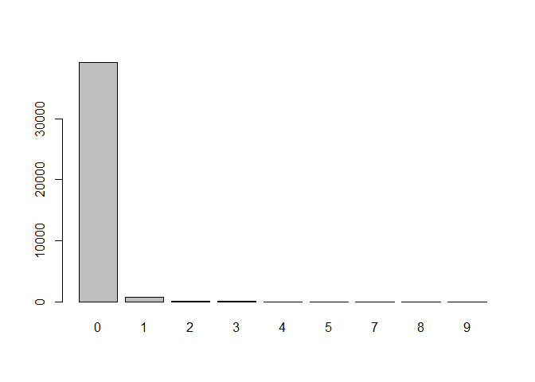

hw04-daniel-john.Rmd
================
Daniel John
April 7, 2018

R Markdown
----------

This is an R Markdown document. Markdown is a simple formatting syntax for authoring HTML, PDF, and MS Word documents. For more details on using R Markdown see <http://rmarkdown.rstudio.com>.

When you click the **Knit** button a document will be generated that includes both content as well as the output of any embedded R code chunks within the document. You can embed an R code chunk like this:

``` r
summary(cars)
```

    ##      speed           dist       
    ##  Min.   : 4.0   Min.   :  2.00  
    ##  1st Qu.:12.0   1st Qu.: 26.00  
    ##  Median :15.0   Median : 36.00  
    ##  Mean   :15.4   Mean   : 42.98  
    ##  3rd Qu.:19.0   3rd Qu.: 56.00  
    ##  Max.   :25.0   Max.   :120.00

Including Plots
---------------

You can also embed plots, for example:


Note that the `echo = FALSE` parameter was added to the code chunk to prevent printing of the R code that generated the plot.

``` r
library("stringr")
```

    ## Warning: package 'stringr' was built under R version 3.4.4

``` r
library("XML")
library("knitr")
```

    ## Warning: package 'knitr' was built under R version 3.4.4

``` r
library("ggplot2")
```

    ## Warning: package 'ggplot2' was built under R version 3.4.4

``` r
library("dplyr")
```

    ## 
    ## Attaching package: 'dplyr'

    ## The following objects are masked from 'package:stats':
    ## 
    ##     filter, lag

    ## The following objects are masked from 'package:base':
    ## 
    ##     intersect, setdiff, setequal, union

``` r
# 1.4) Archive of "stringr"
source("..//..//hw04/code/archive-functions.R")
```

    ## Warning in clean_archive("XML"): NAs introduced by coercion

``` r
raw_data <- read_archive('stringr')
raw_data
```

    ##                      Name    Last modified Size Description
    ## 1                    <NA>             <NA> <NA>        <NA>
    ## 2        Parent Directory                Â    -           Â
    ## 3   stringr_0.1.10.tar.gz 2009-11-09 16:57 6.8K           Â
    ## 4      stringr_0.2.tar.gz 2009-11-16 20:25  10K           Â
    ## 5      stringr_0.3.tar.gz 2010-02-15 18:06  11K           Â
    ## 6      stringr_0.4.tar.gz 2010-08-24 16:33  16K           Â
    ## 7      stringr_0.5.tar.gz 2011-06-30 19:12  18K           Â
    ## 8    stringr_0.6.1.tar.gz 2012-07-25 21:59  20K           Â
    ## 9    stringr_0.6.2.tar.gz 2012-12-06 08:40  20K           Â
    ## 10     stringr_0.6.tar.gz 2011-12-08 20:02  20K           Â
    ## 11   stringr_1.0.0.tar.gz 2015-04-30 11:48  34K           Â
    ## 12   stringr_1.1.0.tar.gz 2016-08-19 21:02  62K           Â
    ## 13   stringr_1.2.0.tar.gz 2017-02-18 21:23  92K           Â
    ## 14                   <NA>             <NA> <NA>        <NA>

``` r
clean_data <- clean_archive('stringr')
clean_data
```

    ##      names version       date size
    ## 1  stringr  0.1.10 2009-11-09  6.8
    ## 2  stringr     0.2 2009-11-16 10.0
    ## 3  stringr     0.3 2010-02-15 11.0
    ## 4  stringr     0.4 2010-08-24 16.0
    ## 5  stringr     0.5 2011-06-30 18.0
    ## 6  stringr   0.6.1 2012-07-25 20.0
    ## 7  stringr   0.6.2 2012-12-06 20.0
    ## 8  stringr     0.6 2011-12-08 20.0
    ## 9  stringr   1.0.0 2015-04-30 34.0
    ## 10 stringr   1.1.0 2016-08-19 62.0
    ## 11 stringr   1.2.0 2017-02-18 92.0

``` r
plot_archive('stringr')
```



``` r
write.csv(clean_data, file = "..//..//hw04/data/stringr-archive.csv")

# 1.5) Archives of "dplyr", "ggplot2", "XML", and "knitr" 
dplyr_data <- read_archive('dplyr')
dplyr_data
```

    ##                     Name    Last modified Size Description
    ## 1                   <NA>             <NA> <NA>        <NA>
    ## 2       Parent Directory                Â    -           Â
    ## 3     dplyr_0.1.1.tar.gz 2014-01-29 21:24 530K           Â
    ## 4     dplyr_0.1.2.tar.gz 2014-02-24 16:36 533K           Â
    ## 5     dplyr_0.1.3.tar.gz 2014-03-15 00:36 535K           Â
    ## 6       dplyr_0.1.tar.gz 2014-01-16 22:53 2.7M           Â
    ## 7       dplyr_0.2.tar.gz 2014-05-21 08:20 577K           Â
    ## 8   dplyr_0.3.0.1.tar.gz 2014-10-08 05:21 629K           Â
    ## 9   dplyr_0.3.0.2.tar.gz 2014-10-11 07:43 628K           Â
    ## 10      dplyr_0.3.tar.gz 2014-10-04 06:39 629K           Â
    ## 11    dplyr_0.4.0.tar.gz 2015-01-08 11:12 870K           Â
    ## 12    dplyr_0.4.1.tar.gz 2015-01-14 07:15 870K           Â
    ## 13    dplyr_0.4.2.tar.gz 2015-06-16 11:24 628K           Â
    ## 14    dplyr_0.4.3.tar.gz 2015-09-01 18:15 641K           Â
    ## 15    dplyr_0.5.0.tar.gz 2016-06-24 15:37 692K           Â
    ## 16    dplyr_0.7.0.tar.gz 2017-06-09 13:08 675K           Â
    ## 17    dplyr_0.7.1.tar.gz 2017-06-22 15:31 676K           Â
    ## 18    dplyr_0.7.2.tar.gz 2017-07-21 01:39 677K           Â
    ## 19    dplyr_0.7.3.tar.gz 2017-09-09 16:04 789K           Â
    ## 20                  <NA>             <NA> <NA>        <NA>

``` r
clean_dplyr <- clean_archive('dplyr')
```

    ## Warning in clean_archive("dplyr"): NAs introduced by coercion

``` r
clean_dplyr
```

    ##    names version       date size
    ## 1  dplyr   0.1.1 2014-01-29  530
    ## 2  dplyr   0.1.2 2014-02-24  533
    ## 3  dplyr   0.1.3 2014-03-15  535
    ## 4  dplyr     0.1 2014-01-16   NA
    ## 5  dplyr     0.2 2014-05-21  577
    ## 6  dplyr 0.3.0.1 2014-10-08  629
    ## 7  dplyr 0.3.0.2 2014-10-11  628
    ## 8  dplyr     0.3 2014-10-04  629
    ## 9  dplyr   0.4.0 2015-01-08  870
    ## 10 dplyr   0.4.1 2015-01-14  870
    ## 11 dplyr   0.4.2 2015-06-16  628
    ## 12 dplyr   0.4.3 2015-09-01  641
    ## 13 dplyr   0.5.0 2016-06-24  692
    ## 14 dplyr   0.7.0 2017-06-09  675
    ## 15 dplyr   0.7.1 2017-06-22  676
    ## 16 dplyr   0.7.2 2017-07-21  677
    ## 17 dplyr   0.7.3 2017-09-09  789

``` r
plot_archive('dplyr')
```

    ## Warning in clean_archive(a): NAs introduced by coercion

    ## Warning: Removed 1 rows containing missing values (geom_point).



``` r
write.csv(clean_dplyr, file = "..//..//hw04/data/dplyr-archive.csv")

ggplot2_data <- read_archive('ggplot2')
ggplot2_data
```

    ##                       Name    Last modified Size Description
    ## 1                     <NA>             <NA> <NA>        <NA>
    ## 2         Parent Directory                Â    -           Â
    ## 3     ggplot2_0.5.1.tar.gz 2007-06-10 21:49 1.8M           Â
    ## 4     ggplot2_0.5.2.tar.gz 2007-06-18 08:10 1.8M           Â
    ## 5     ggplot2_0.5.4.tar.gz 2007-07-08 21:58 1.8M           Â
    ## 6     ggplot2_0.5.5.tar.gz 2007-09-01 13:04 1.8M           Â
    ## 7     ggplot2_0.5.6.tar.gz 2007-10-20 09:22 1.8M           Â
    ## 8     ggplot2_0.5.7.tar.gz 2008-01-11 18:32 1.8M           Â
    ## 9       ggplot2_0.5.tar.gz 2007-06-01 14:27 7.1M           Â
    ## 10      ggplot2_0.6.tar.gz 2008-04-03 18:26 1.9M           Â
    ## 11      ggplot2_0.7.tar.gz 2008-10-05 13:01 1.9M           Â
    ## 12    ggplot2_0.8.1.tar.gz 2008-12-14 12:08 1.9M           Â
    ## 13    ggplot2_0.8.2.tar.gz 2009-02-25 08:50 2.0M           Â
    ## 14    ggplot2_0.8.3.tar.gz 2009-04-20 19:22 2.0M           Â
    ## 15    ggplot2_0.8.4.tar.gz 2009-12-09 16:32 2.0M           Â
    ## 16    ggplot2_0.8.5.tar.gz 2009-12-16 08:37 2.0M           Â
    ## 17    ggplot2_0.8.6.tar.gz 2010-02-18 17:53 2.0M           Â
    ## 18    ggplot2_0.8.7.tar.gz 2010-03-02 17:58 2.0M           Â
    ## 19    ggplot2_0.8.8.tar.gz 2010-07-05 20:25 2.0M           Â
    ## 20    ggplot2_0.8.9.tar.gz 2010-12-23 19:17 2.0M           Â
    ## 21      ggplot2_0.8.tar.gz 2008-11-21 09:25 1.9M           Â
    ## 22    ggplot2_0.9.0.tar.gz 2012-03-01 08:01 1.6M           Â
    ## 23    ggplot2_0.9.1.tar.gz 2012-05-08 04:15 9.1M           Â
    ## 24  ggplot2_0.9.2.1.tar.gz 2012-09-11 12:19 2.2M           Â
    ## 25    ggplot2_0.9.2.tar.gz 2012-09-04 08:16 2.2M           Â
    ## 26  ggplot2_0.9.3.1.tar.gz 2013-03-02 15:57 2.2M           Â
    ## 27    ggplot2_0.9.3.tar.gz 2012-12-05 13:11 2.2M           Â
    ## 28    ggplot2_1.0.0.tar.gz 2014-05-21 15:36 2.2M           Â
    ## 29    ggplot2_1.0.1.tar.gz 2015-03-17 17:49 2.2M           Â
    ## 30    ggplot2_2.0.0.tar.gz 2015-12-18 10:45 1.5M           Â
    ## 31    ggplot2_2.1.0.tar.gz 2016-03-01 15:47 1.5M           Â
    ## 32    ggplot2_2.2.0.tar.gz 2016-11-11 12:24 2.1M           Â
    ## 33                    <NA>             <NA> <NA>        <NA>

``` r
clean_ggplot2 <- clean_archive('ggplot2')
```

    ## Warning in clean_archive("ggplot2"): NAs introduced by coercion

``` r
clean_ggplot2
```

    ##     names version       date size
    ## 1  ggplot   0.5.1 2007-06-10   NA
    ## 2  ggplot   0.5.2 2007-06-18   NA
    ## 3  ggplot   0.5.4 2007-07-08   NA
    ## 4  ggplot   0.5.5 2007-09-01   NA
    ## 5  ggplot   0.5.6 2007-10-20   NA
    ## 6  ggplot   0.5.7 2008-01-11   NA
    ## 7  ggplot     0.5 2007-06-01   NA
    ## 8  ggplot     0.6 2008-04-03   NA
    ## 9  ggplot     0.7 2008-10-05   NA
    ## 10 ggplot   0.8.1 2008-12-14   NA
    ## 11 ggplot   0.8.2 2009-02-25   NA
    ## 12 ggplot   0.8.3 2009-04-20   NA
    ## 13 ggplot   0.8.4 2009-12-09   NA
    ## 14 ggplot   0.8.5 2009-12-16   NA
    ## 15 ggplot   0.8.6 2010-02-18   NA
    ## 16 ggplot   0.8.7 2010-03-02   NA
    ## 17 ggplot   0.8.8 2010-07-05   NA
    ## 18 ggplot   0.8.9 2010-12-23   NA
    ## 19 ggplot     0.8 2008-11-21   NA
    ## 20 ggplot   0.9.0 2012-03-01   NA
    ## 21 ggplot   0.9.1 2012-05-08   NA
    ## 22 ggplot 0.9.2.1 2012-09-11   NA
    ## 23 ggplot   0.9.2 2012-09-04   NA
    ## 24 ggplot 0.9.3.1 2013-03-02   NA
    ## 25 ggplot   0.9.3 2012-12-05   NA
    ## 26 ggplot   1.0.0 2014-05-21   NA
    ## 27 ggplot   1.0.1 2015-03-17   NA
    ## 28 ggplot   2.0.0 2015-12-18   NA
    ## 29 ggplot   2.1.0 2016-03-01   NA
    ## 30 ggplot   2.2.0 2016-11-11   NA

``` r
plot_archive('ggplot2')
```

    ## Warning in clean_archive(a): NAs introduced by coercion

    ## Warning: Removed 30 rows containing missing values (geom_point).



``` r
write.csv(clean_ggplot2, file = "..//..//hw04/data/ggplot2-archive.csv")

XML_data <- read_archive('XML')
XML_data
```

    ##                     Name    Last modified Size Description
    ## 1                   <NA>             <NA> <NA>        <NA>
    ## 2       Parent Directory                Â    -           Â
    ## 3         XML_0.2.tar.gz 2000-11-15 09:54 283K           Â
    ## 4       XML_0.3-3.tar.gz 2000-12-12 12:38 316K           Â
    ## 5       XML_0.6-1.tar.gz 2001-06-28 11:44 319K           Â
    ## 6       XML_0.6-2.tar.gz 2001-06-28 12:22 318K           Â
    ## 7       XML_0.6-3.tar.gz 2001-07-11 19:58 319K           Â
    ## 8       XML_0.7-0.tar.gz 2001-10-28 15:11 348K           Â
    ## 9       XML_0.7-1.tar.gz 2001-10-30 15:37 348K           Â
    ## 10      XML_0.7-2.tar.gz 2001-11-29 15:15 348K           Â
    ## 11      XML_0.7-3.tar.gz 2002-02-01 20:46 348K           Â
    ## 12      XML_0.7-4.tar.gz 2002-02-08 23:31 349K           Â
    ## 13      XML_0.7-5.tar.gz 2002-03-27 10:10 349K           Â
    ## 14      XML_0.8-0.tar.gz 2002-04-26 17:46 349K           Â
    ## 15      XML_0.8-2.tar.gz 2002-05-10 15:14 350K           Â
    ## 16      XML_0.9-0.tar.gz 2002-07-14 13:12 482K           Â
    ## 17      XML_0.9-1.tar.gz 2002-08-30 09:08 483K           Â
    ## 18     XML_0.92-1.tar.gz 2002-10-07 08:16 510K           Â
    ## 19     XML_0.92-2.tar.gz 2002-10-12 12:13 510K           Â
    ## 20     XML_0.93-0.tar.gz 2002-11-06 09:12 385K           Â
    ## 21     XML_0.93-1.tar.gz 2002-11-08 17:01 511K           Â
    ## 22     XML_0.93-2.tar.gz 2003-03-05 11:54 511K           Â
    ## 23     XML_0.93-3.tar.gz 2003-03-09 19:36 511K           Â
    ## 24     XML_0.93-4.tar.gz 2003-05-04 11:06 513K           Â
    ## 25     XML_0.94-0.tar.gz 2003-08-15 17:10 515K           Â
    ## 26     XML_0.94-1.tar.gz 2003-08-17 10:02 532K           Â
    ## 27     XML_0.95-0.tar.gz 2003-09-23 21:41 535K           Â
    ## 28     XML_0.95-1.tar.gz 2003-10-01 23:04 535K           Â
    ## 29     XML_0.95-3.tar.gz 2003-10-07 19:35 538K           Â
    ## 30     XML_0.95-4.tar.gz 2003-10-28 14:15 539K           Â
    ## 31     XML_0.95-6.tar.gz 2003-11-26 11:25 538K           Â
    ## 32     XML_0.97-0.tar.gz 2004-11-22 10:23 543K           Â
    ## 33     XML_0.97-3.tar.gz 2005-04-08 12:37 539K           Â
    ## 34     XML_0.97-4.tar.gz 2005-05-09 09:57 546K           Â
    ## 35     XML_0.97-6.tar.gz 2005-05-21 10:36 550K           Â
    ## 36     XML_0.97-7.tar.gz 2005-06-02 10:19 551K           Â
    ## 37     XML_0.97-8.tar.gz 2005-08-10 07:54 545K           Â
    ## 38     XML_0.99-2.tar.gz 2005-12-12 15:05 552K           Â
    ## 39     XML_0.99-4.tar.gz 2005-12-16 15:20 553K           Â
    ## 40     XML_0.99-5.tar.gz 2005-12-21 09:27 554K           Â
    ## 41     XML_0.99-6.tar.gz 2006-01-01 22:56 554K           Â
    ## 42     XML_0.99-7.tar.gz 2006-04-05 10:09 561K           Â
    ## 43     XML_0.99-8.tar.gz 2006-07-10 08:07 569K           Â
    ## 44    XML_0.99-92.tar.gz 2006-09-11 17:52 565K           Â
    ## 45    XML_0.99-93.tar.gz 2006-09-15 09:34 565K           Â
    ## 46      XML_1.1-1.tar.gz 2006-10-27 18:53 782K           Â
    ## 47      XML_1.2-0.tar.gz 2006-11-15 10:26 787K           Â
    ## 48      XML_1.3-2.tar.gz 2006-12-10 20:30 805K           Â
    ## 49      XML_1.4-0.tar.gz 2006-12-16 11:50 805K           Â
    ## 50      XML_1.4-1.tar.gz 2007-01-07 11:12 795K           Â
    ## 51      XML_1.5-1.tar.gz 2007-03-14 21:02 797K           Â
    ## 52      XML_1.6-0.tar.gz 2007-03-15 19:57 798K           Â
    ## 53      XML_1.6-2.tar.gz 2007-03-27 10:42 801K           Â
    ## 54      XML_1.6-3.tar.gz 2007-04-06 14:11 801K           Â
    ## 55      XML_1.7-1.tar.gz 2007-04-18 09:41 820K           Â
    ## 56      XML_1.7-2.tar.gz 2007-04-23 11:39 820K           Â
    ## 57      XML_1.7-3.tar.gz 2007-04-26 19:44 821K           Â
    ## 58      XML_1.9-0.tar.gz 2007-05-10 09:09 829K           Â
    ## 59     XML_1.92-0.tar.gz 2007-08-25 16:33 840K           Â
    ## 60     XML_1.92-1.tar.gz 2007-09-01 12:14 840K           Â
    ## 61     XML_1.93-1.tar.gz 2007-10-01 12:13 849K           Â
    ## 62     XML_1.93-2.tar.gz 2007-10-03 20:51 850K           Â
    ## 63     XML_1.95-1.tar.gz 2008-05-07 18:39 609K           Â
    ## 64     XML_1.95-2.tar.gz 2008-05-13 21:37 603K           Â
    ## 65     XML_1.95-3.tar.gz 2008-06-27 08:47 603K           Â
    ## 66     XML_1.96-0.tar.gz 2008-07-28 10:29 700K           Â
    ## 67     XML_1.98-0.tar.gz 2008-10-15 12:39 630K           Â
    ## 68     XML_1.98-1.tar.gz 2008-10-20 12:15 633K           Â
    ## 69     XML_1.99-0.tar.gz 2008-12-30 18:11 636K           Â
    ## 70      XML_2.1-0.tar.gz 2009-02-19 11:22 638K           Â
    ## 71      XML_2.3-0.tar.gz 2009-03-06 18:29 644K           Â
    ## 72      XML_2.5-0.tar.gz 2009-06-02 22:27 660K           Â
    ## 73      XML_2.5-1.tar.gz 2009-06-07 16:00 660K           Â
    ## 74      XML_2.5-3.tar.gz 2009-06-25 17:43 661K           Â
    ## 75      XML_2.6-0.tar.gz 2009-08-04 19:09 664K           Â
    ## 76      XML_2.8-1.tar.gz 2010-03-21 15:06 759K           Â
    ## 77      XML_3.1-0.tar.gz 2010-05-08 09:36 763K           Â
    ## 78      XML_3.1-1.tar.gz 2010-08-12 13:45 761K           Â
    ## 79      XML_3.2-0.tar.gz 2010-10-05 18:44 761K           Â
    ## 80      XML_3.4-0.tar.gz 2011-04-30 15:01 875K           Â
    ## 81      XML_3.4-2.tar.gz 2011-08-04 14:22 875K           Â
    ## 82      XML_3.4-3.tar.gz 2011-09-14 08:46 885K           Â
    ## 83      XML_3.6-0.tar.gz 2011-11-29 08:30 887K           Â
    ## 84      XML_3.6-1.tar.gz 2011-11-30 09:49 887K           Â
    ## 85      XML_3.6-2.tar.gz 2011-12-09 10:31 887K           Â
    ## 86      XML_3.7-2.tar.gz 2012-01-08 16:41 890K           Â
    ## 87      XML_3.7-3.tar.gz 2012-01-11 09:43 890K           Â
    ## 88      XML_3.7-4.tar.gz 2012-01-12 10:54 890K           Â
    ## 89      XML_3.8-0.tar.gz 2012-01-14 10:36 894K           Â
    ## 90      XML_3.9-0.tar.gz 2012-01-18 16:14 901K           Â
    ## 91      XML_3.9-2.tar.gz 2012-01-21 11:13 902K           Â
    ## 92      XML_3.9-4.tar.gz 2012-01-31 08:37 902K           Â
    ## 93   XML_3.95-0.1.tar.gz 2012-10-02 08:12 1.6M           Â
    ## 94   XML_3.95-0.2.tar.gz 2013-03-07 09:14 1.6M           Â
    ## 95     XML_3.95-0.tar.gz 2012-09-30 20:47 1.6M           Â
    ## 96   XML_3.96-0.1.tar.gz 2013-03-20 17:44 1.6M           Â
    ## 97   XML_3.96-0.2.tar.gz 2013-03-21 12:31 1.6M           Â
    ## 98   XML_3.96-1.1.tar.gz 2013-03-28 18:13 1.5M           Â
    ## 99   XML_3.98-1.1.tar.gz 2013-06-20 15:50 1.5M           Â
    ## 100  XML_3.98-1.2.tar.gz 2015-05-31 08:28 1.5M           Â
    ## 101  XML_3.98-1.3.tar.gz 2015-06-30 14:32 1.5M           Â
    ## 102  XML_3.98-1.4.tar.gz 2016-03-01 10:54 1.5M           Â
    ## 103  XML_3.98-1.5.tar.gz 2016-11-10 15:39 1.5M           Â
    ## 104  XML_3.98-1.6.tar.gz 2017-03-30 10:03 1.5M           Â
    ## 105  XML_3.98-1.7.tar.gz 2017-05-03 12:29 1.5M           Â
    ## 106  XML_3.98-1.8.tar.gz 2017-06-15 08:27 1.5M           Â
    ## 107  XML_3.98-1.9.tar.gz 2017-06-19 14:43 1.5M           Â
    ## 108                 <NA>             <NA> <NA>        <NA>

``` r
clean_XML <- clean_archive('XML')
```

    ## Warning in clean_archive("XML"): NAs introduced by coercion

``` r
clean_XML
```

    ##     names  version       date size
    ## 1     XML      0.2 2000-11-15  283
    ## 2     XML    0.3-3 2000-12-12  316
    ## 3     XML    0.6-1 2001-06-28  319
    ## 4     XML    0.6-2 2001-06-28  318
    ## 5     XML    0.6-3 2001-07-11  319
    ## 6     XML    0.7-0 2001-10-28  348
    ## 7     XML    0.7-1 2001-10-30  348
    ## 8     XML    0.7-2 2001-11-29  348
    ## 9     XML    0.7-3 2002-02-01  348
    ## 10    XML    0.7-4 2002-02-08  349
    ## 11    XML    0.7-5 2002-03-27  349
    ## 12    XML    0.8-0 2002-04-26  349
    ## 13    XML    0.8-2 2002-05-10  350
    ## 14    XML    0.9-0 2002-07-14  482
    ## 15    XML    0.9-1 2002-08-30  483
    ## 16    XML   0.92-1 2002-10-07  510
    ## 17    XML   0.92-2 2002-10-12  510
    ## 18    XML   0.93-0 2002-11-06  385
    ## 19    XML   0.93-1 2002-11-08  511
    ## 20    XML   0.93-2 2003-03-05  511
    ## 21    XML   0.93-3 2003-03-09  511
    ## 22    XML   0.93-4 2003-05-04  513
    ## 23    XML   0.94-0 2003-08-15  515
    ## 24    XML   0.94-1 2003-08-17  532
    ## 25    XML   0.95-0 2003-09-23  535
    ## 26    XML   0.95-1 2003-10-01  535
    ## 27    XML   0.95-3 2003-10-07  538
    ## 28    XML   0.95-4 2003-10-28  539
    ## 29    XML   0.95-6 2003-11-26  538
    ## 30    XML   0.97-0 2004-11-22  543
    ## 31    XML   0.97-3 2005-04-08  539
    ## 32    XML   0.97-4 2005-05-09  546
    ## 33    XML   0.97-6 2005-05-21  550
    ## 34    XML   0.97-7 2005-06-02  551
    ## 35    XML   0.97-8 2005-08-10  545
    ## 36    XML   0.99-2 2005-12-12  552
    ## 37    XML   0.99-4 2005-12-16  553
    ## 38    XML   0.99-5 2005-12-21  554
    ## 39    XML   0.99-6 2006-01-01  554
    ## 40    XML   0.99-7 2006-04-05  561
    ## 41    XML   0.99-8 2006-07-10  569
    ## 42    XML  0.99-92 2006-09-11  565
    ## 43    XML  0.99-93 2006-09-15  565
    ## 44    XML    1.1-1 2006-10-27  782
    ## 45    XML    1.2-0 2006-11-15  787
    ## 46    XML    1.3-2 2006-12-10  805
    ## 47    XML    1.4-0 2006-12-16  805
    ## 48    XML    1.4-1 2007-01-07  795
    ## 49    XML    1.5-1 2007-03-14  797
    ## 50    XML    1.6-0 2007-03-15  798
    ## 51    XML    1.6-2 2007-03-27  801
    ## 52    XML    1.6-3 2007-04-06  801
    ## 53    XML    1.7-1 2007-04-18  820
    ## 54    XML    1.7-2 2007-04-23  820
    ## 55    XML    1.7-3 2007-04-26  821
    ## 56    XML    1.9-0 2007-05-10  829
    ## 57    XML   1.92-0 2007-08-25  840
    ## 58    XML   1.92-1 2007-09-01  840
    ## 59    XML   1.93-1 2007-10-01  849
    ## 60    XML   1.93-2 2007-10-03  850
    ## 61    XML   1.95-1 2008-05-07  609
    ## 62    XML   1.95-2 2008-05-13  603
    ## 63    XML   1.95-3 2008-06-27  603
    ## 64    XML   1.96-0 2008-07-28  700
    ## 65    XML   1.98-0 2008-10-15  630
    ## 66    XML   1.98-1 2008-10-20  633
    ## 67    XML   1.99-0 2008-12-30  636
    ## 68    XML    2.1-0 2009-02-19  638
    ## 69    XML    2.3-0 2009-03-06  644
    ## 70    XML    2.5-0 2009-06-02  660
    ## 71    XML    2.5-1 2009-06-07  660
    ## 72    XML    2.5-3 2009-06-25  661
    ## 73    XML    2.6-0 2009-08-04  664
    ## 74    XML    2.8-1 2010-03-21  759
    ## 75    XML    3.1-0 2010-05-08  763
    ## 76    XML    3.1-1 2010-08-12  761
    ## 77    XML    3.2-0 2010-10-05  761
    ## 78    XML    3.4-0 2011-04-30  875
    ## 79    XML    3.4-2 2011-08-04  875
    ## 80    XML    3.4-3 2011-09-14  885
    ## 81    XML    3.6-0 2011-11-29  887
    ## 82    XML    3.6-1 2011-11-30  887
    ## 83    XML    3.6-2 2011-12-09  887
    ## 84    XML    3.7-2 2012-01-08  890
    ## 85    XML    3.7-3 2012-01-11  890
    ## 86    XML    3.7-4 2012-01-12  890
    ## 87    XML    3.8-0 2012-01-14  894
    ## 88    XML    3.9-0 2012-01-18  901
    ## 89    XML    3.9-2 2012-01-21  902
    ## 90    XML    3.9-4 2012-01-31  902
    ## 91    XML 3.95-0.1 2012-10-02   NA
    ## 92    XML 3.95-0.2 2013-03-07   NA
    ## 93    XML   3.95-0 2012-09-30   NA
    ## 94    XML 3.96-0.1 2013-03-20   NA
    ## 95    XML 3.96-0.2 2013-03-21   NA
    ## 96    XML 3.96-1.1 2013-03-28   NA
    ## 97    XML 3.98-1.1 2013-06-20   NA
    ## 98    XML 3.98-1.2 2015-05-31   NA
    ## 99    XML 3.98-1.3 2015-06-30   NA
    ## 100   XML 3.98-1.4 2016-03-01   NA
    ## 101   XML 3.98-1.5 2016-11-10   NA
    ## 102   XML 3.98-1.6 2017-03-30   NA
    ## 103   XML 3.98-1.7 2017-05-03   NA
    ## 104   XML 3.98-1.8 2017-06-15   NA
    ## 105   XML 3.98-1.9 2017-06-19   NA

``` r
plot_archive('XML')
```

    ## Warning in clean_archive(a): NAs introduced by coercion

    ## Warning: Removed 15 rows containing missing values (geom_point).

    ## Warning: Removed 15 rows containing missing values (geom_path).



``` r
write.csv(clean_XML, file = "..//..//hw04/data/XML-archive.csv")

knitr_data <- read_archive('knitr')
knitr_data
```

    ##                    Name    Last modified Size Description
    ## 1                  <NA>             <NA> <NA>        <NA>
    ## 2      Parent Directory                Â    -           Â
    ## 3      knitr_0.1.tar.gz 2012-01-17 08:59 102K           Â
    ## 4      knitr_0.2.tar.gz 2012-01-28 23:06 221K           Â
    ## 5      knitr_0.3.tar.gz 2012-02-28 09:37 231K           Â
    ## 6      knitr_0.4.tar.gz 2012-04-29 09:27 236K           Â
    ## 7      knitr_0.5.tar.gz 2012-04-29 21:00 248K           Â
    ## 8    knitr_0.6.3.tar.gz 2012-06-22 17:52 292K           Â
    ## 9      knitr_0.6.tar.gz 2012-06-11 06:48 286K           Â
    ## 10     knitr_0.7.tar.gz 2012-07-17 07:16 325K           Â
    ## 11     knitr_0.8.tar.gz 2012-09-04 21:06 425K           Â
    ## 12     knitr_0.9.tar.gz 2013-01-20 14:45 431K           Â
    ## 13   knitr_1.0.5.tar.gz 2013-01-21 14:47 441K           Â
    ## 14     knitr_1.0.tar.gz 2013-01-14 08:50 441K           Â
    ## 15     knitr_1.1.tar.gz 2013-02-16 17:53 519K           Â
    ## 16     knitr_1.2.tar.gz 2013-07-16 08:53 486K           Â
    ## 17     knitr_1.3.tar.gz 2013-07-15 16:55 595K           Â
    ## 18   knitr_1.4.1.tar.gz 2013-08-12 09:24 725K           Â
    ## 19     knitr_1.4.tar.gz 2013-08-10 10:51 725K           Â
    ## 20     knitr_1.5.tar.gz 2013-09-28 11:56 720K           Â
    ## 21     knitr_1.6.tar.gz 2014-05-25 08:05 967K           Â
    ## 22     knitr_1.7.tar.gz 2014-10-13 10:41 807K           Â
    ## 23     knitr_1.8.tar.gz 2014-11-11 09:04 782K           Â
    ## 24     knitr_1.9.tar.gz 2015-01-20 07:30 659K           Â
    ## 25  knitr_1.10.5.tar.gz 2015-05-06 16:20 672K           Â
    ## 26    knitr_1.10.tar.gz 2015-04-23 18:47 672K           Â
    ## 27    knitr_1.11.tar.gz 2015-08-14 08:27 673K           Â
    ## 28  knitr_1.12.3.tar.gz 2016-01-22 10:26 811K           Â
    ## 29    knitr_1.12.tar.gz 2016-01-07 13:55 686K           Â
    ## 30    knitr_1.13.tar.gz 2016-05-09 21:42 866K           Â
    ## 31    knitr_1.14.tar.gz 2016-08-13 11:33 1.0M           Â
    ## 32  knitr_1.15.1.tar.gz 2016-11-22 09:36 1.0M           Â
    ## 33    knitr_1.15.tar.gz 2016-11-09 18:28 1.0M           Â
    ## 34    knitr_1.16.tar.gz 2017-05-18 11:05 1.0M           Â
    ## 35    knitr_1.17.tar.gz 2017-08-10 06:27 752K           Â
    ## 36    knitr_1.18.tar.gz 2017-12-27 23:55 635K           Â
    ## 37    knitr_1.19.tar.gz 2018-01-29 12:01 635K           Â
    ## 38                 <NA>             <NA> <NA>        <NA>

``` r
clean_knitr <- clean_archive('knitr')
```

    ## Warning in clean_archive("knitr"): NAs introduced by coercion

``` r
clean_knitr
```

    ##    names version       date size
    ## 1  knitr     0.1 2012-01-17  102
    ## 2  knitr     0.2 2012-01-28  221
    ## 3  knitr     0.3 2012-02-28  231
    ## 4  knitr     0.4 2012-04-29  236
    ## 5  knitr     0.5 2012-04-29  248
    ## 6  knitr   0.6.3 2012-06-22  292
    ## 7  knitr     0.6 2012-06-11  286
    ## 8  knitr     0.7 2012-07-17  325
    ## 9  knitr     0.8 2012-09-04  425
    ## 10 knitr     0.9 2013-01-20  431
    ## 11 knitr   1.0.5 2013-01-21  441
    ## 12 knitr     1.0 2013-01-14  441
    ## 13 knitr     1.1 2013-02-16  519
    ## 14 knitr     1.2 2013-07-16  486
    ## 15 knitr     1.3 2013-07-15  595
    ## 16 knitr   1.4.1 2013-08-12  725
    ## 17 knitr     1.4 2013-08-10  725
    ## 18 knitr     1.5 2013-09-28  720
    ## 19 knitr     1.6 2014-05-25  967
    ## 20 knitr     1.7 2014-10-13  807
    ## 21 knitr     1.8 2014-11-11  782
    ## 22 knitr     1.9 2015-01-20  659
    ## 23 knitr  1.10.5 2015-05-06  672
    ## 24 knitr    1.10 2015-04-23  672
    ## 25 knitr    1.11 2015-08-14  673
    ## 26 knitr  1.12.3 2016-01-22  811
    ## 27 knitr    1.12 2016-01-07  686
    ## 28 knitr    1.13 2016-05-09  866
    ## 29 knitr    1.14 2016-08-13   NA
    ## 30 knitr  1.15.1 2016-11-22   NA
    ## 31 knitr    1.15 2016-11-09   NA
    ## 32 knitr    1.16 2017-05-18   NA
    ## 33 knitr    1.17 2017-08-10  752
    ## 34 knitr    1.18 2017-12-27  635
    ## 35 knitr    1.19 2018-01-29  635

``` r
plot_archive('knitr')
```

    ## Warning in clean_archive(a): NAs introduced by coercion

    ## Warning: Removed 4 rows containing missing values (geom_point).



``` r
write.csv(clean_knitr, file = "..//..//hw04/data/knitr-archive.csv")

combo <- rbind(clean_dplyr, clean_ggplot2, clean_XML, clean_knitr)
ggplot(combo, aes(date, size), aes(color = names)) + geom_point() + geom_step()
```

    ## Warning: Removed 50 rows containing missing values (geom_point).



``` r
ggplot(combo, aes(date, size), aes(color = names), scales = free) + geom_point() + geom_step() + facet_wrap(~names)
```

    ## Warning: Removed 50 rows containing missing values (geom_point).

    ## Warning: Removed 15 rows containing missing values (geom_path).



``` r
# 2) Regex Functions
source("..//..//hw04/code/regex-functions.R")

# 2.1) Splitting Characters
split_chars('Go Bears!')
```

    ## [1] "G" "o" " " "B" "e" "a" "r" "s" "!"

``` r
split_chars('Expecto Patronum')
```

    ##  [1] "E" "x" "p" "e" "c" "t" "o" " " "P" "a" "t" "r" "o" "n" "u" "m"

``` r
# 2.2) Number of Vowels
vec <- c('G', 'o', '', 'B', 'e', 'a', 'r', 's', '!')
num_vowels(vec)
```

    ## a e i o u 
    ## 1 1 0 1 0

``` r
# 2.3) Counting Vowels
count_vowels("The quick brown fox jumps over the lazy dog")
```

    ## a e i o u 
    ## 1 3 1 4 2

``` r
count_vowels("THE QUICK BROWN FOX JUMPS OVER THE LAZY DOG")
```

    ## a e i o u 
    ## 1 3 1 4 2

``` r
# 2.4) Reversing Characters
reverse_chars("gattaca")
```

    ## [1] "acattag"

``` r
reverse_chars("Lumox Maxima")
```

    ## [1] "amixaM xomuL"

``` r
# 2.5) Reversing Sentences by Words
reverse_words("sentence! this reverse")
```

    ## [1] "reverse this sentence!"

``` r
reverse_words("string")
```

    ## [1] "string"

``` r
# 3) Data "Emotion in Text"
emotion <- read.csv("..//..//hw04/data/text_emotion.csv", stringsAsFactors = FALSE)

# 3.1) Number of characters per tweet
a <- nchar(emotion$content)

# Count the number of characters in tweet contents.
sum(a)
```

    ## [1] 2937515

``` r
# Display a summary() of such counts and plot a historgram...
summary(a)
```

    ##    Min. 1st Qu.  Median    Mean 3rd Qu.    Max. 
    ##    1.00   43.00   69.00   73.44  103.00  184.00

``` r
hist(a, 
     breaks = 36.8,
     main = "Number of characters per tweet", 
     xlab = "Characters",
     ylab = "Tweets",
     border = "blue", 
     col = "aquamarine1")
```



``` r
# 3.2) Number of Mentions
c <- emotion$content
c <- str_extract_all(c, pattern = "@[a-z|A-Z|0-9]+")
d <- str_count(c, "@")

# Count the number of @ mentions
sum(d)
```

    ## [1] 19896

``` r
# Display the frequencies and make a barplot
e <- table(d)
barplot(e)
```



``` r
# 3.3) Hashtags
f <- emotion$content
f <- str_extract_all(f, pattern = "#[a-z|A-Z|0-9]+")
g <- str_count(f, "#")

# Number of hashtags in tweet contents
sum(g)
```

    ## [1] 938

``` r
# Barplot of the counts
h <- table(g)
barplot(h)
```



``` r
# Average length of hashtags
i <- grep("#.", f, value = TRUE)
j <- nchar(i)
mean(j)
```

    ## [1] 11.32152

``` r
# Mode of hashtags
#' @title getmode()
#' @description calculates the mode of a vector 
#' @return the numeric mode
getmode <- function(j){
   uniqj <- unique(j)
   uniqj[which.max(tabulate(match(j, uniqj)))]
   }
getmode(j)
```

    ## [1] 3
