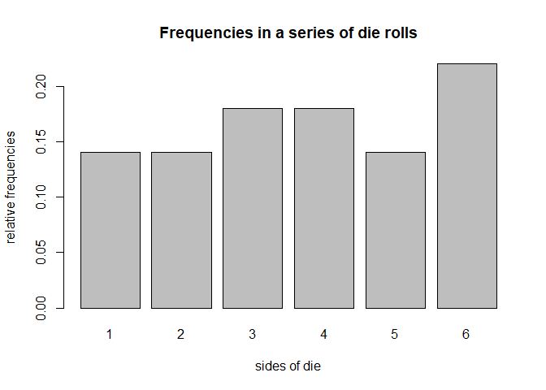
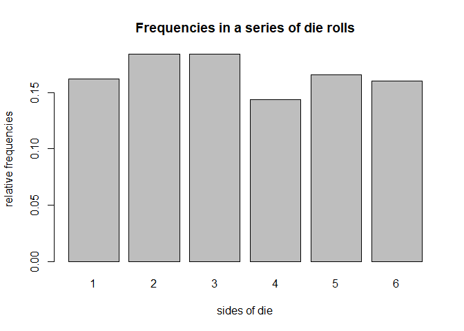

hw05-daniel-john.Rmd
================
Daniel John
April 25, 2018

``` r
#1) Object "die"
#' @title die object function
#' @description returns a die object given sides and probability
#' @param sides is a six element vector, by default numbers 1,2,3,4,5,6. must be 6 element 
#' @param prob is a vector of probabilities for each side, by default all equal to 1/6. must sum to 1
#' @return columns showing the sides of the die and the probability of rolling each one

die <- function(sides, prob){
  check_sides <- function(sides){
    return(length(sides) != 6)
  }
  check_prob <- function(prob){
    return(sum(prob) != 1)
  }
  
  
  if (missing(sides)){
    die_sides <- c(1,2,3,4,5,6)}
  else {(die_sides = sides)
  }
  if (missing(prob)){
    die_prob <- c(1/6,1/6,1/6,1/6,1/6,1/6)}
  else {(die_prob = prob)
  }
  
  
  if (check_sides(die_sides)) {
    stop("'sides' must be a vector of length 6")
  } else if (check_prob(die_prob)) {
    stop("elements in 'prob' must add up to 1")
  }
  
  a <- c(die_sides,die_prob)
  b <- matrix(a, nrow = 6, ncol = 2)
  c <- as.data.frame(b)
  colnames(c) <- c("side", "prob")
  
  die <- list(prob_dist = c)
  class(die) <- "die"
  return (die)
} 

print.die <- function(x, ...) {
  cat('object "die"\n\n')
  print(x$prob_dist)
  invisible(x)
}

# default call: creates a standard fair die
fair_die <- die()
fair_die
```

    ## object "die"
    ## 
    ##   side      prob
    ## 1    1 0.1666667
    ## 2    2 0.1666667
    ## 3    3 0.1666667
    ## 4    4 0.1666667
    ## 5    5 0.1666667
    ## 6    6 0.1666667

``` r
# die with non-standard sides
weird_die <- die(sides = c('i', 'ii', 'iii', 'iv', 'v', 'vi'))
weird_die
```

    ## object "die"
    ## 
    ##   side              prob
    ## 1    i 0.166666666666667
    ## 2   ii 0.166666666666667
    ## 3  iii 0.166666666666667
    ## 4   iv 0.166666666666667
    ## 5    v 0.166666666666667
    ## 6   vi 0.166666666666667

``` r
# create a loaded die
loaded_die <- die(prob = c(0.075, 0.1, 0.125, 0.15, 0.20, 0.35))
loaded_die
```

    ## object "die"
    ## 
    ##   side  prob
    ## 1    1 0.075
    ## 2    2 0.100
    ## 3    3 0.125
    ## 4    4 0.150
    ## 5    5 0.200
    ## 6    6 0.350

``` r
# bad sides
bad_die <- die(sides = c("a", "b", "c", "d", "e"))
```

    ## Error in die(sides = c("a", "b", "c", "d", "e")): 'sides' must be a vector of length 6

``` r
# bad prob
bad_die <- die(
  sides = c("a", "b", "c", "d", "e", "f"),
  prob = c(0.2, 0.1, 0.1, 0.1, 0.5, 0.1))
```

    ## Error in die(sides = c("a", "b", "c", "d", "e", "f"), prob = c(0.2, 0.1, : elements in 'prob' must add up to 1

``` r
#2) Object "roll"
#' @title die roll function
#' @description returns the results of rolls given the die and number of rolls
#' @param die is a die usually called from the other object die
#' @param times is a nonnegative integer
#' @return the side of the die that resulted for each individual die roll

roll <- function(die, times = 1) {
  check_times <- function(times) {
    if (!times.isinteger() | times < 1) {
      stop("Invalid input for number of times.")
    }
  }
  
  rolls <- c()
  sides <- c(die$prob_dist$side)
  prob <- c(die$prob_dist$prob)
  total <- times
  
  samples = runif(times, 0, 1)
  
  sofar = 0
  for (i in (1:times)) {
    if (samples[i] < prob[1]) {
      rolls <- c(rolls, sides[1])
    } else if (samples[i] < prob[1] + prob[2]) {
      rolls <- c(rolls, sides[2])
    } else if (samples[i] < prob[1] + prob[2] + prob[3]) {
      rolls <- c(rolls, sides[3])
    } else if (samples[i] < prob[1] + prob[2] + prob[3] + prob[4]) {
      rolls <- c(rolls, sides[4])
      sofar = sofar + prob[4]
    } else if (samples[i] < prob[1] + prob[2] + prob[3] + prob[4] + prob[5]) {
      rolls <- c(rolls, sides[5])
      sofar <- sofar + prob[5]
    } else if (samples[i] < prob[1] + prob[2] + prob[3] + prob[4] + prob[5] + prob[6]) {
      rolls <- c(rolls, sides[6])
    }
  }
  
  roll <- list(rolls = rolls, sides = sides, prob = prob, total = total)
  class(roll) <- "roll"
  roll
}

print.roll <- function(x, ...) {
  cat('object "roll"\n\n')
  cat("$rolls\n")
  print(x$rolls)
  invisible(x)
}


# fair die 50 times
fair_50 <- roll(fair_die, times = 50)
fair_50
```

    ## object "roll"
    ## 
    ## $rolls
    ##  [1] 3 5 3 3 3 2 2 5 1 1 6 6 4 4 2 5 5 3 1 6 3 6 4 6 6 1 3 4 2 3 6 5 6 4 3
    ## [36] 5 4 4 1 4 2 1 6 6 2 4 6 5 1 2

``` r
# what's in fair50?
names(fair_50)
```

    ## [1] "rolls" "sides" "prob"  "total"

``` r
fair_50$rolls
```

    ##  [1] 3 5 3 3 3 2 2 5 1 1 6 6 4 4 2 5 5 3 1 6 3 6 4 6 6 1 3 4 2 3 6 5 6 4 3
    ## [36] 5 4 4 1 4 2 1 6 6 2 4 6 5 1 2

``` r
fair_50$sides
```

    ## [1] 1 2 3 4 5 6

``` r
fair_50$prob
```

    ## [1] 0.1666667 0.1666667 0.1666667 0.1666667 0.1666667 0.1666667

``` r
fair_50$total
```

    ## [1] 50

``` r
# string die
str_die <- die(
  sides = c("a", "b", "c", "d", "e", "f"),
  prob = c(0.075, 0.1, 0.125, 0.15, 0.20, 0.35)
)

# roll 20 times
set.seed(123)
str_rolls <- roll(str_die, times = 20)
names(str_rolls)
```

    ## [1] "rolls" "sides" "prob"  "total"

``` r
str_rolls
```

    ## object "roll"
    ## 
    ## $rolls
    ##  [1] 1 1 1 1 1 1 1 1 1 1 1 1 1 1 1 1 1 1 1 1

``` r
#3) Summary method for "roll" objects
#' @title summary-roll function
#' @description returns a dataframe with the side, count, and proportion of each roll of a die
#' @param die is a die usually called from the other object die
#' @return a dataframe with the side, count, and proportion of each roll of a die
summary.roll <- function(x, ...){
  side <- x$sides
  count <- as.data.frame(table(x$rolls))[, 2]
  prop <- (count/x$total)
  
  freqs <- data.frame(side, count, prop)
  object <- list(freqs = freqs)
  class(object) <- "summary_roll"
  object
  
}

print.summary.roll <- function(x, ...){
  cat('summary "roll" \n \n')
  print(as.data.frame(x$object))
  invisible(x)
}

set.seed(123)
fair_50rolls <- roll(fair_die, times = 50)
fair_50sum <- summary(fair_50rolls)

fair_50sum
```

    ## $freqs
    ##   side count prop
    ## 1    1     8 0.16
    ## 2    2     9 0.18
    ## 3    3     8 0.16
    ## 4    4     7 0.14
    ## 5    5     7 0.14
    ## 6    6    11 0.22
    ## 
    ## attr(,"class")
    ## [1] "summary_roll"

``` r
# what's in the summary
class(fair_50sum)
```

    ## [1] "summary_roll"

``` r
names(fair_50sum)
```

    ## [1] "freqs"

``` r
fair_50sum$freqs
```

    ##   side count prop
    ## 1    1     8 0.16
    ## 2    2     9 0.18
    ## 3    3     8 0.16
    ## 4    4     7 0.14
    ## 5    5     7 0.14
    ## 6    6    11 0.22

``` r
#4) Plot method for "roll" objects
#' @title plot-roll function
#' @description returns a barplot with the frequency of each die face appearing over the number of rolls
#' @param rolls is a set series of die rolls
#' @return a barplot with "sides of die" on the x axis and "relative frequencies" on the y axis

plot_roll <- function(x){
  a <- table(x$rolls) / x$total
  b <- barplot(a, main = "Frequencies in a series of die rolls", xlab = "sides of die", ylab = "relative frequencies")

}

plot_roll(fair_50)
```



``` r
one_freqs <- function(x) {
  cumsum(x$rolls == x$rolls[1]) / x$total
}

two_freqs <- function(x) {
  cumsum(x$rolls == x$rolls[2]) / x$total
}

three_freqs <- function(x) {
  cumsum(x$rolls == x$rolls[3]) / x$total
}

four_freqs <- function(x) {
  cumsum(x$rolls == x$rolls[4]) / x$total
}

five_freqs <- function(x) {
  cumsum(x$rolls == x$rolls[5]) / x$total
}

six_freqs <- function(x) {
  cumsum(x$rolls == x$rolls[6]) / x$total
}
```

``` r
#5) Additional Methods

#' @title extraction method
#' @description a function to extract the value of a given roll
#' @param rolls is a set series of die rolls
#' @return the value of a specified roll

"[.roll" <- function(x, i){
  x$roll[i]
}


#' @title replacement method
#' @description a function to replace the value of a given roll
#' @param rolls is a set series of die rolls
#' @return an updated version of the number of rolls

"[<-.roll" <- function(x, i, value){
  x$roll[i] <- value
  make_roll(x$die, x$roll)
}


#' @title addition method
#' @description a function to add a specified number of rolls
#' @param rolls is a set series of die rolls
#' @return an updated version of the roll object with the new total number of rolls

"+.roll" <- function(object, increment){
  if (length(increment) != 1 | increment <= 0){
    stop("\ninvalid increment")
  }
  object$total <- object$total + increment
  more_tosses <- rolls(object, times = increment)
  object$rolls <- c(object$rolls, more_tosses)
  return(object)
}
```

``` r
# Example

# roll fair die
set.seed(123)
fair_die <- die()
fair500 <- roll(fair_die, times = 500)

# summary method
summary(fair500)
```

    ## $freqs
    ##   side count  prop
    ## 1    1    81 0.162
    ## 2    2    92 0.184
    ## 3    3    92 0.184
    ## 4    4    72 0.144
    ## 5    5    83 0.166
    ## 6    6    80 0.160
    ## 
    ## attr(,"class")
    ## [1] "summary_roll"

``` r
# extracting roll in position 500
fair500[500]
```

    ## [1] 5

``` r
# replacing last roll
fair500[500] <- 1
```

    ## Error in make_roll(x$die, x$roll): could not find function "make_roll"

``` r
fair500[500]
```

    ## [1] 5

``` r
summary(fair500)
```

    ## $freqs
    ##   side count  prop
    ## 1    1    81 0.162
    ## 2    2    92 0.184
    ## 3    3    92 0.184
    ## 4    4    72 0.144
    ## 5    5    83 0.166
    ## 6    6    80 0.160
    ## 
    ## attr(,"class")
    ## [1] "summary_roll"

``` r
# adding 100 rolls
fair600 <- fair500 + 100
```

    ## Error in rolls(object, times = increment): could not find function "rolls"

``` r
summary(fair600)
```

    ## Error in summary(fair600): object 'fair600' not found

``` r
# plot method
plot_roll(fair500)
```



``` r
# De Mere's problem
# Problem I:

six_count = 0
for(i in seq(from = 1,to = 1000)){
  x <- roll(die(), 4)
  if(6 %in% x$rolls){
    six_count = six_count +1
  }
}

# games with at least one 6
games_with_six <- print(six_count)
```

    ## [1] 518

``` r
games_with_six
```

    ## [1] 518

``` r
# relative frequency of getting at least one 6
games_with_six_frequency <- games_with_six / 4000
games_with_six_frequency
```

    ## [1] 0.1295

``` r
# Problem II: 
six_count_b = 0
for(num in seq(from = 1, to = 1000)){
for(i in seq(from = 1,to = 24)){
  x <- roll(die(), 1)
  y <- roll(die(), 1)
  if((6 %in% x$rolls) & (6 %in% y$rolls)){
    six_count_b = six_count_b +1
  }
}
}

# games with a double 6
games_with_double_six <- print(six_count_b)
```

    ## [1] 659

``` r
games_with_double_six
```

    ## [1] 659

``` r
# relative frequency of getting a game with a double 6
double_six_frequency <- games_with_double_six / 48000
double_six_frequency
```

    ## [1] 0.01372917
